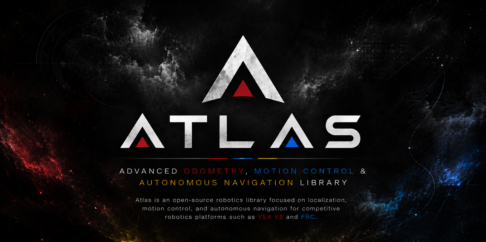

<p align="center">
  
</p>

<div align="center">

# 🌍 Atlas

### Advanced Odometry, Motion Control & Autonomous Navigation Library

Atlas is an open-source robotics library focused on localization, motion control, and autonomous navigation for competitive robotics platforms such as VEX V5 and FRC.

The project provides reusable components for building autonomous robots, from accurate odometry and PID-based motion control to advanced path following algorithms.


</div>

# 📖 Table of Contents

* [Features](#-features)
* [Project Goals](#-project-goals)
* [Core Concepts](#-core-concepts)
* [Project Structure](#-project-structure)
* [Supported Platforms](#-supported-platforms)
* [Getting Started](#-getting-started)
* [Quick Start Example](#-quick-start-example)
* [Development Roadmap](#-development-roadmap)
* [Documentation](#-documentation)
* [Learning Path](#️-learning-path)
* [Source Layout](#-source-layout)
* [FAQ](#-faq)
* [Contributing](#-contributing)
* [Acknowledgments](#-acknowledgments)
* [License](#-license)

---

# ✨ Features

### 📍 Localization

* Two Wheel Odometry
* Three Wheel Odometry
* IMU Integration
* Pose Estimation
* Real-Time Position Tracking

### 🎯 Motion Control

* PID Controllers
* Drive to Point
* Turn to Angle
* Motion Profiling

### 🗺️ Path Following

* Waypoints
* Path Generation
* Pure Pursuit *(planned)*
* Advanced Navigation Algorithms *(planned)*

---

# 🚀 Project Goals

Atlas is being developed as a modular robotics library that can be used in both educational projects and robotics competitions.

Current goals include:

* Accurate robot localization
* Reliable closed-loop motion control
* Expandable autonomous navigation
* Easy integration into robotics projects

The library is intended to be modular, well documented, and easy to extend as new algorithms are added.

---

# 🧮 Core Concepts

Atlas is built around several fundamental robotics concepts:

* Odometry
* Robot Kinematics
* Coordinate Transformations
* PID Control
* Motion Profiling
* Path Following
* Path Planning

---

# 📦 Project Structure

```text
atlas/
├── math/
├── odometry/
├── control/
├── path/
└── examples/
```

Each module is designed to be independent so that individual components can be used without requiring the entire library.

---

# 🎮 Supported Platforms

| Platform      | Support |
| ------------- | :-----: |
| VEX V5        |    ✅    |
| FRC           |    ✅    |
| Java Projects |    ✅    |

---

# 🧰 Getting Started

These steps outline the general workflow for bringing Atlas into a robot project. Exact steps may vary slightly depending on your platform (VEX V5 or FRC) and build system.

### Prerequisites

* A working VEX V5 or FRC project template
* Java or C++ toolchain configured for your platform (depending on target)
* Basic familiarity with odometry and closed-loop control concepts (see [Documentation](#-documentation))

### Installation

1. Clone the repository into your workspace:
   ```bash
   git clone https://github.com/your-org/atlas.git
   ```
2. Copy or link the relevant module folders (`math/`, `odometry/`, `control/`, `path/`) into your project's source directory.
3. Include the required headers/imports for the modules you plan to use.
4. Build your project as usual — Atlas modules are designed to compile independently, so you only need to bring in what you use.

> 💡 Tip: Start with the `math/` and `odometry/` modules first, since most other components depend on them for pose and position data.

---

# 🧪 Quick Start Example

A minimal example showing the general shape of how Atlas components are intended to work together once implemented:

```java
// Initialize odometry
ThreeWheelOdometry odometry = new ThreeWheelOdometry(leftEncoder, rightEncoder, backEncoder, trackWidth);

// Update pose estimate each control loop
Pose2D currentPose = odometry.update();

// Drive to a target point using closed-loop control
DriveToPoint driveController = new DriveToPoint(odometry, pidConfig);
driveController.setTarget(new Vector2D(24, 36));

while (!driveController.isFinished()) {
    driveController.update();
}
```

> ⚠️ This example is illustrative of the intended API shape. Refer to the module documentation and source comments for the exact, up-to-date usage as each component is implemented.

---

# 🛠 Development Roadmap

## Version 0.1

* [ ] Vector2D
* [ ] Pose2D
* [ ] PID Controller
* [ ] Three Wheel Odometry

## Version 0.2

* [ ] Two Wheel + IMU Odometry
* [ ] Drive to Point
* [ ] Turn to Angle

## Version 0.3

* [ ] Path Following
* [ ] Pure Pursuit

## Version 1.0

* [ ] Complete Autonomous Navigation Framework

---

# 📚 Documentation

The documentation is intended to introduce both the theory behind robot localization and the implementation used in Atlas.

|  #  | Topic                                                   | Description                        |
| :-: | ------------------------------------------------------- | ---------------------------------- |
|  01 | [What Is Odometry?](docs/01-What-Is-Odometry.md)        | Introduction to odometry           |
|  02 | [History Of Odometry](docs/02-History-Of-Odometry.md)   | Historical background              |
|  03 | [How Odometry Works](docs/03-How-Odometry-Works.md)     | Mathematical foundations           |
|  04 | [Applications](docs/04-Applications.md)                 | Practical applications             |
|  05 | [Localization Systems](docs/05-Localization-Systems.md) | Modern localization methods        |
|  06 | [Tracking Wheels](docs/06-Tracking-Wheels.md)           | Dead wheels, offsets, and geometry |
|  07 | [IMU](docs/07-IMU.md)                                   | Inertial Measurement Units         |
|  08 | [GPS](docs/08-GPS.md)                                   | Satellite positioning              |
|  09 | [Computer Vision](docs/09-Computer-Vision.md)           | Vision-based localization          |
|  10 | [Sensor Fusion](docs/10-Sensor-Fusion.md)               | Combining multiple sensors         |
|  11 | [PID Control](docs/11-PID-Control.md)                   | Closed-loop control                |
|  12 | [Pure Pursuit](docs/12-Pure-Pursuit.md)                 | Path following algorithm           |
|  13 | [Path Planning](docs/13-Path-Planning.md)               | Route generation                   |
|  14 | [Math Behind Atlas](docs/14-Math-Behind-Atlas.md)       | Mathematical reference             |

---

# 🗺️ Learning Path

```text
What Is Odometry?
        │
        ▼
History Of Odometry
        │
        ▼
How Odometry Works
        │
        ▼
 Tracking Wheels
        │
        ▼
       IMU
        │
        ▼
       GPS
        │
        ▼
 Computer Vision 
        │
        ▼
  Sensor Fusion
        │
        ▼
   PID Control
        │
        ▼
  Pure Pursuit
        │
        ▼
  Path Planning
        │
        ▼
Math Behind Atlas
```

---
## 📂 Source Layout

```text
src/
├── 📁 [math](src/math/)
├── 📁 [sensors](src/sensors/)
├── 📁 [control](src/control/)
├── 📁 [PID](src/PID/)
├── 📁 [GoTo](src/GoTo/)
├── 📁 [PurePursuit](src/PurePursuit/)
└── 📁 [examples](src/examples/)
```


## 📂 Source Layout

| Module | Description |
|--------|-------------|
| [`math/`](src/math/) | Mathematical utilities, vectors, poses, and transformations |
| [`sensors/`](src/sensors/) | Sensor interfaces and hardware abstractions |
| [`control/`](src/control/) | Shared motion control utilities |
| [`PID/`](src/PID/) | PID controller implementations |
| [`GoTo/`](src/GoTo/) | Drive-to-point and turn-to-angle algorithms |
| [`PurePursuit/`](src/PurePursuit/) | Pure Pursuit path following |
| [`examples/`](src/examples/) | Example projects and sample code |

---

# ❓ FAQ

**Is Atlas ready for use in a competition robot right now?**
Atlas is under active development. Some modules are still marked as in-progress on the roadmap, so it's best to check the version roadmap above before relying on a specific feature in a competition setting.

**Does Atlas work with both VEX V5 and FRC?**
Yes — the core math, odometry, and control modules are designed to be platform-agnostic where possible, with platform-specific glue code kept separate so it's easy to adapt Atlas to either ecosystem.

**Can I use just one module without pulling in the whole library?**
Yes. Every module under `src/` is built to be as independent as possible, so you can, for example, use only the PID controller without bringing in the path-following code.

**Where should I start if I'm new to odometry?**
Start with the [Documentation](#-documentation) table above — it's ordered as a learning path, beginning with "What Is Odometry?" and building up to the math behind Atlas.

---

# 🤝 Contributing

Contributions of any kind are welcome. If you find a bug, have an idea for an improvement, or would like to implement a new feature, feel free to open an issue or submit a pull request.

A few things that help keep contributions smooth:

* Check open issues before starting work to avoid duplicate effort.
* Keep pull requests focused on a single feature or fix where possible.
* Add or update relevant documentation under `docs/` when introducing new concepts or modules.
* Follow the existing structure and naming conventions used in the `src/` layout.

Whether it's fixing a typo, improving a doc page, or adding a new algorithm, all contributions help move the project forward.

---

# 🙏 Acknowledgments

Atlas is inspired by the broader competitive robotics community — including the odometry, motion control, and path-following work shared publicly by VEX and FRC teams over the years. Thanks to everyone who contributes code, documentation, issues, and ideas to help this project grow.

---

# 📄 License

This project is licensed under the Apache License 2.0.
